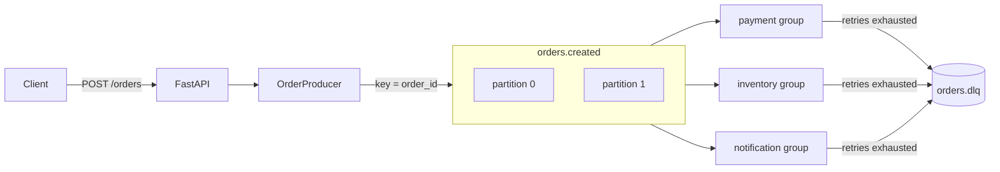
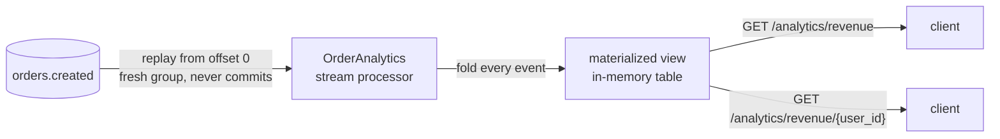
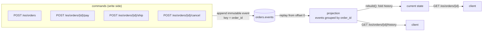

# kafka-zero-to-hero

A hands-on Kafka learning lab: a small **Order Processing** system on [Aiven Kafka](https://aiven.io/), built to
*feel* every core concept — producer, consumer, topic, partition, consumer group, offset,
key/ordering, at-least-once, retries, dead-letter, idempotency, and rebalancing — and then three
higher-level patterns layered on the same topics: **event-driven fan-out**, **stream processing**,
and **event sourcing**.

All three share one idea: the log is the source of truth, and everything else is derived from it.
Here is each pattern on its own so the flow stays clear.

## Pattern 1 — Event-driven fan-out

`POST /orders` publishes one `OrderCreated` event; three independent consumer groups react to it.
Each group has its own offsets, so the same order is charged **and** reserved **and** emailed.



The key (`order_id`) pins an order to one partition, so its events stay ordered. Each group commits
only after success (at-least-once); after `max_retries` failures it parks the record in `orders.dlq`
and commits, so a poison message never blocks the partition. Run two copies of one service to watch
the group **rebalance** across the two partitions.

## Pattern 2 — Stream processing (KStream → KTable)

A background stream processor folds the *same* `orders.created` log into a running table of
analytics, and the API serves that table directly (interactive queries).



It uses a fresh group id on every start, so it replays the whole topic from the beginning and never
commits — because a **table is the entire stream folded up**, not just new messages. Restart the API
and the totals rebuild themselves from the log. That is the stream/table duality in miniature.

## Pattern 3 — Event sourcing

The order's state is never stored — only the immutable events that happened to it. Commands append
events to `orders.events`; current state and history are **derived** by replaying that log per order.



Every command is one append — you never update or delete. `GET /es/orders/{id}` folds the order's
events into current state on the fly; `GET .../history` is a free audit trail. Restart the API and
any order rebuilds from offset 0 — the log is the database, memory is just a cache of the fold.
(Read model and write model are decoupled through Kafka, so the projection is eventually consistent.)

## Layout

| Path | Job |
|---|---|
| `app/config.py`   | Aiven connection config + topic names (shared) |
| `app/schemas.py`  | `OrderCreated` event — object ⇄ bytes (shared contract) |
| `app/kafka/admin.py`    | create topics with 2 partitions (run once) |
| `app/kafka/producer.py` | `OrderProducer` — the only writer to Kafka |
| `app/kafka/consumer.py` | `run_consumer()` — reusable poll/commit/retry/DLQ loop |
| `app/services/*.py`     | payment / inventory / notification — one consumer group each |
| `app/stream/analytics.py`     | stream processor: fold the log into an in-memory table |
| `app/eventsourcing/events.py` | event types + `rebuild()` reducer (state = fold of events) |
| `app/eventsourcing/store.py`  | append-only event store + projection (read model) |

**Each pattern owns its own API**, so you can run one in isolation:

| Feature | API module | Endpoints | Run alone |
|---|---|---|---|
| Event-driven  | `app/eventdriven/api.py`   | `POST /orders`      | `uvicorn app.eventdriven.api:app` |
| Streams       | `app/stream/api.py`        | `GET /analytics/*`  | `uvicorn app.stream.api:app` |
| Event sourcing| `app/eventsourcing/api.py` | `/es/*`             | `uvicorn app.eventsourcing.api:app` |
| **All three** | `app/api.py`               | everything above    | `uvicorn app.api:app` |

Every feature module exposes `router`, `start()`, `stop()`, and its own `app`; `app/api.py` is just a
composition root that mounts the three routers and starts/stops each. Running a feature's app boots
**only** that feature's background work (e.g. `app.stream.api` starts just the analytics processor).

**Read it as:** shared contracts (`config`, `schemas`) → plumbing (`kafka/`) → self-contained features
(`eventdriven/`, `services/`, `stream/`, `eventsourcing/`, each with its own `api.py`) → composition root (`app/api.py`).

## Setup

Copy `.env.example` to `.env`, fill in the Aiven values, and download the CA cert to `ca.pem`.

```bash
uv sync
```

## Run order

```bash
uv run python -m app.kafka.admin              # 1. create topics (once)
```

Then start **all patterns at once**:

```bash
uv run uvicorn app.api:app --reload           # API on :8000 (starts stream + ES projections too)
uv run python -m app.services.payment         # payment consumer (run 2 to see rebalancing)
uv run python -m app.services.inventory       # inventory consumer
uv run python -m app.services.notification    # notification consumer
```

…or start **just the one feature** you want to play with:

```bash
uv run uvicorn app.eventdriven.api:app --reload      # only POST /orders
uv run uvicorn app.stream.api:app --reload           # only GET /analytics/*
uv run uvicorn app.eventsourcing.api:app --reload    # only /es/*
```

## Try each pattern

**1. Event-driven** — publish an order, watch the three services react:

```bash
curl -X POST localhost:8000/orders -H 'content-type: application/json' \
  -d '{"order_id":"ORD-1001","user_id":"U-123","items":["book"],"amount":42.0}'
```

**2. Streams** — query the materialized view (give it a second after a fresh API start):

```bash
curl localhost:8000/analytics/revenue
curl localhost:8000/analytics/revenue/U-123
```

**3. Event sourcing** — drive one order through its lifecycle, then read derived state + history:

```bash
curl -X POST localhost:8000/es/orders -H 'content-type: application/json' \
  -d '{"order_id":"ORD-1","user_id":"U-123","items":["book","pen"],"amount":50.0}'
curl -X POST "localhost:8000/es/orders/ORD-1/pay?amount=50.0"
curl -X POST "localhost:8000/es/orders/ORD-1/ship?tracking=Z9-88"

curl localhost:8000/es/orders/ORD-1            # current state, folded from events
curl localhost:8000/es/orders/ORD-1/history    # the audit trail
```

