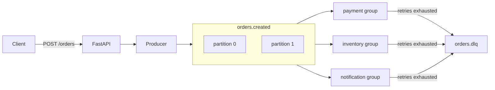

# kafka-zero-to-hero

A hands-on Kafka learning lab: a small **Order Processing** event pipeline on Aiven Kafka,
built to *feel* every core concept — producer, consumer, topic, partition, consumer group,
offset, key/ordering, at-least-once, retries, dead-letter, idempotency, and rebalancing.

## Flow



Each group reads the same topic independently (one order is charged, reserved, *and* emailed). Offsets are per group. After `max_retries` failures, that group publishes the original record to `orders.dlq` and commits so the poison message does not block the partition.

## Layout

| Path | Job |
|---|---|
| `app/config.py`   | Aiven connection config + topic names (shared) |
| `app/schemas.py`  | `OrderCreated` event — object ⇄ bytes (shared contract) |
| `app/kafka/admin.py`    | create topics with 2 partitions (run once) |
| `app/kafka/producer.py` | `OrderProducer` — the only writer to Kafka |
| `app/kafka/consumer.py` | `run_consumer()` — reusable poll/commit/retry/DLQ loop |
| `app/services/*.py`     | payment / inventory / notification — one consumer group each |
| `app/api.py`      | FastAPI edge: `POST /orders` → publish event |

**Read it as:** shared contracts (`config`, `schemas`) → plumbing (`kafka/`) → your logic (`services/`) → the door in (`api`).

## Setup

Copy `.env.example` to `.env`, fill in the Aiven values, and download the CA cert to `ca.pem`.

```bash
uv sync
```

## Run order

```bash
uv run python -m app.kafka.admin              # 1. create topics (once)
uv run uvicorn app.api:app --reload           # 2. API on :8000
uv run python -m app.services.payment         # 3. payment consumer (run 2 to see rebalancing)
uv run python -m app.services.inventory       # 4. inventory consumer
uv run python -m app.services.notification    # 5. notification consumer
```

Send an order:

```bash
curl -X POST localhost:8000/orders -H 'content-type: application/json' \
  -d '{"order_id":"ORD-1001","user_id":"U-123","items":["book"],"amount":42.0}'
```
