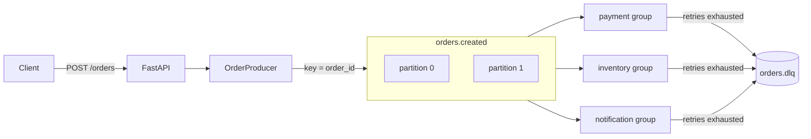
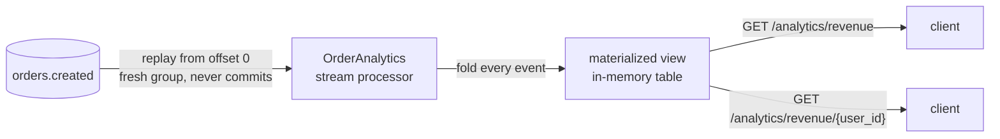
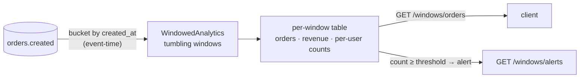
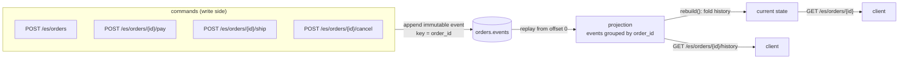
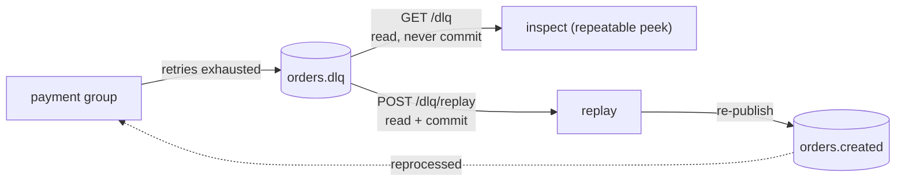

# kafka-zero-to-hero

A hands-on Kafka learning lab: a small **Order Processing** system on [Aiven Kafka](https://aiven.io/), built to
*feel* every core concept — producer, consumer, topic, partition, consumer group, offset,
key/ordering, at-least-once, retries, dead-letter, idempotency, and rebalancing — and then five
higher-level patterns layered on the same topics: **event-driven fan-out**, **stream processing**,
**windowed analytics**, **event sourcing**, and **dead-letter recovery**.

They all share one idea: the log is the source of truth, and everything else is derived from it.
Here is each pattern on its own so the flow stays clear.

## How it works in one minute

All five treat the Kafka log as the source of truth. #1 *reacts* to events, #2 and #3 *summarize*
them (all-time vs per-window), #4 *reconstructs* an entity from them, and #5 *recovers* the ones that
failed.

**1. Event-driven fan-out** — one event, many independent reactors.
`POST /orders {ORD-1, U-9, $42}` writes one record to `orders.created`; three consumer groups each
read it on their own — payment charges $42, inventory reserves the item, notification emails U-9.
They don't know about each other; a slow or crashed one doesn't block the rest. The producer's job
ends at "wrote the event."

**2. Stream processing** — fold the endless stream into a live summary.
```
orders.created:  ORD-1 U-9 $42 | ORD-2 U-9 $8 | ORD-3 U-5 $15
running table:   total $65 · U-9 $50 (2) · U-5 $15 (1)
```
`GET /analytics/revenue` returns that table instantly. Restart and it replays every event to rebuild
the same totals — the events are the truth, the table is derived.

**3. Windowed analytics** — the same totals, sliced into time buckets.
```
12:00:10 U-9 | 12:00:40 U-9 | 12:00:55 U-9 | 12:01:20 U-9
window 12:00 -> U-9 = 3 orders   window 12:01 -> U-9 = 1 order
```
`GET /windows/orders` gives counts per minute; `/windows/alerts` flags U-9 in the 12:00 window
(3 orders in one minute). It buckets by when the order *happened*, so a late order still lands in its
correct minute.

**4. Event sourcing** — store the changes, compute the state.
```
commands ->  OrderCreated(ORD-1,$50) | PaymentCompleted | OrderShipped(Z9)
```
Nothing stores "status = shipped." `GET /es/orders/ORD-1` replays those three facts into
`{status: SHIPPED, amount: 50, tracking: Z9}`, and `/history` returns the full audit trail. Current
state is folded from the event history every time — a perfect audit log for free.

**5. Dead-letter inspect & replay** — recover messages that failed.
```
BAD-1 fails 3 retries -> parked in orders.dlq
GET /dlq            -> peek (repeatable, never consumes)
POST /dlq/replay    -> re-publish to orders.created + commit (drains the backlog)
```
A DLQ is just another topic. Inspect reads it *without committing* (looking doesn't consume); replay
re-drives the backlog through the pipeline and commits. Fix the root cause first — replay only cures
*transient* failures.

## Pattern 1 — Event-driven fan-out

`POST /orders` publishes one `OrderCreated` event; three independent consumer groups react to it.
Each group has its own offsets, so the same order is charged **and** reserved **and** emailed.



The key (`order_id`) pins an order to one partition, so its events stay ordered. Each group commits
only after success (at-least-once); after `max_retries` failures it parks the record in `orders.dlq`
and commits, so a poison message never blocks the partition. Run two copies of one service to watch
the group **rebalance** across the two partitions.

## Pattern 2 — Stream processing (KStream → KTable)

A background stream processor folds the *same* `orders.created` log into a running table of
analytics, and the API serves that table directly (interactive queries).



It uses a fresh group id on every start, so it replays the whole topic from the beginning and never
commits — because a **table is the entire stream folded up**, not just new messages. Restart the API
and the totals rebuild themselves from the log. That is the stream/table duality in miniature.

## Pattern 3 — Windowed analytics

The all-time table above answers "how much ever?". A **window** slices the stream into fixed time
buckets to answer "how much *per minute*?" — and per-user counts per window give a velocity/fraud
alert for free.



Each order is bucketed by its own `created_at` (**event-time**), not when it's consumed — so a late
or out-of-order event still lands in its correct window, and replaying the log reproduces the exact
same windows. A user crossing the per-window threshold (default 3 orders/minute) shows up in
`/windows/alerts`. (Real Kafka Streams *closes* a window after a grace period and drops later
stragglers; this lab keeps every bucket, trading bounded state for never losing a late event.)

## Pattern 4 — Event sourcing

The order's state is never stored — only the immutable events that happened to it. Commands append
events to `orders.events`; current state and history are **derived** by replaying that log per order.



Every command is one append — you never update or delete. `GET /es/orders/{id}` folds the order's
events into current state on the fly; `GET .../history` is a free audit trail. Restart the API and
any order rebuilds from offset 0 — the log is the database, memory is just a cache of the fold.
(Read model and write model are decoupled through Kafka, so the projection is eventually consistent.)

## Pattern 5 — Dead-letter inspect & replay

Pattern 1 parks poison messages in `orders.dlq` but nothing reads them. This makes that dead-letter
topic operational: peek at the backlog, then re-drive it through the pipeline once the cause is fixed.



Both operations use the `dlq-replayer` group, whose **committed offset is the line between handled and
pending**. Inspect reads from that offset to the high-water mark and *never commits*, so peeking is
repeatable. Replay does the same read, re-publishes each record to `orders.created`, then *commits* to
drain the backlog. Because it re-drives the pipeline, replay fixes **transient** failures (the random
gateway timeout succeeds next time); a **permanent** fault (an `amount <= 0` order, which payment
rejects deterministically) simply lands back in the DLQ — so fix the root cause before replaying.

## Layout

| Path | Job |
|---|---|
| `app/config.py`   | Aiven connection config + topic names (shared) |
| `app/schemas.py`  | `OrderCreated` event — object ⇄ bytes (shared contract) |
| `app/kafka/admin.py`    | create topics with 2 partitions (run once) |
| `app/kafka/producer.py` | `OrderProducer` — the only writer to Kafka |
| `app/kafka/consumer.py` | `run_consumer()` — reusable poll/commit/retry/DLQ loop |
| `app/services/*.py`     | payment / inventory / notification — one consumer group each |
| `app/stream/analytics.py`     | stream processor: fold the log into an in-memory table |
| `app/windows/processor.py`    | tumbling-window aggregates bucketed by event-time |
| `app/eventsourcing/events.py` | event types + `rebuild()` reducer (state = fold of events) |
| `app/eventsourcing/store.py`  | append-only event store + projection (read model) |
| `app/dlq/inspector.py`        | inspect/replay `orders.dlq` (manual assign + watermarks) |

**Each pattern owns its own API**, so you can run one in isolation:

| Feature | API module | Endpoints | Run alone |
|---|---|---|---|
| Event-driven  | `app/eventdriven/api.py`   | `POST /orders`      | `uvicorn app.eventdriven.api:app` |
| Streams       | `app/stream/api.py`        | `GET /analytics/*`  | `uvicorn app.stream.api:app` |
| Windows       | `app/windows/api.py`       | `GET /windows/*`    | `uvicorn app.windows.api:app` |
| Event sourcing| `app/eventsourcing/api.py` | `/es/*`             | `uvicorn app.eventsourcing.api:app` |
| Dead-letter   | `app/dlq/api.py`           | `GET /dlq`, `POST /dlq/replay` | `uvicorn app.dlq.api:app` |
| **All five**  | `app/api.py`               | everything above    | `uvicorn app.api:app` |

Every feature module exposes `router`, `start()`, `stop()`, and its own `app`; `app/api.py` is just a
composition root that mounts the five routers and starts/stops each. Running a feature's app boots
**only** that feature's background work (e.g. `app.windows.api` starts just the windowed processor;
`app.dlq.api` starts no background work at all — DLQ ops are on-demand).
Note the windows feature only *reads* `orders.created`, so produce with `POST /orders` (or run the
combined app) to feed it.

**Read it as:** shared contracts (`config`, `schemas`) → plumbing (`kafka/`) → self-contained features
(`eventdriven/`, `services/`, `stream/`, `windows/`, `eventsourcing/`, `dlq/`, each with its own `api.py`) → composition root (`app/api.py`).

## Setup

Copy `.env.example` to `.env`, fill in the Aiven values, and download the CA cert to `ca.pem`.

```bash
uv sync
```

## Run order

```bash
uv run python -m app.kafka.admin              # 1. create topics (once)
```

Then start **all patterns at once**:

```bash
uv run uvicorn app.api:app --reload           # API on :8000 (starts stream + ES projections too)
uv run python -m app.services.payment         # payment consumer (run 2 to see rebalancing)
uv run python -m app.services.inventory       # inventory consumer
uv run python -m app.services.notification    # notification consumer
```

…or start **just the one feature** you want to play with:

```bash
uv run uvicorn app.eventdriven.api:app --reload      # only POST /orders
uv run uvicorn app.stream.api:app --reload           # only GET /analytics/*
uv run uvicorn app.windows.api:app --reload          # only GET /windows/*
uv run uvicorn app.eventsourcing.api:app --reload    # only /es/*
uv run uvicorn app.dlq.api:app --reload              # only /dlq + /dlq/replay
```

## Try each pattern

**1. Event-driven** — publish an order, watch the three services react:

```bash
curl -X POST localhost:8000/orders -H 'content-type: application/json' \
  -d '{"order_id":"ORD-1001","user_id":"U-123","items":["book"],"amount":42.0}'
```

**2. Streams** — query the materialized view (give it a second after a fresh API start):

```bash
curl localhost:8000/analytics/revenue
curl localhost:8000/analytics/revenue/U-123
```

**3. Windows** — send a burst for one user within a minute, then read the per-window table + alerts:

```bash
for i in 1 2 3 4; do
  curl -s -X POST localhost:8000/orders -H 'content-type: application/json' \
    -d "{\"order_id\":\"ORD-$i\",\"user_id\":\"U-123\",\"items\":[\"book\"],\"amount\":10.0}" >/dev/null
done
curl localhost:8000/windows/orders     # order count + revenue per 60s window
curl localhost:8000/windows/alerts      # users at/over 3 orders in one window
```

**4. Event sourcing** — drive one order through its lifecycle, then read derived state + history:

```bash
curl -X POST localhost:8000/es/orders -H 'content-type: application/json' \
  -d '{"order_id":"ORD-1","user_id":"U-123","items":["book","pen"],"amount":50.0}'
curl -X POST "localhost:8000/es/orders/ORD-1/pay?amount=50.0"
curl -X POST "localhost:8000/es/orders/ORD-1/ship?tracking=Z9-88"

curl localhost:8000/es/orders/ORD-1            # current state, folded from events
curl localhost:8000/es/orders/ORD-1/history    # the audit trail
```

**5. Dead-letter** — seed a poison order (needs the payment consumer running), then inspect + replay:

```bash
curl -X POST localhost:8000/orders -H 'content-type: application/json' \
  -d '{"order_id":"BAD-1","user_id":"U-9","items":["x"],"amount":0}'   # amount 0 -> always fails -> DLQ

curl localhost:8000/dlq                 # peek the backlog (repeatable — never consumes)
curl -X POST localhost:8000/dlq/replay  # re-publish to orders.created + commit (drains it)
curl localhost:8000/dlq                 # backlog now drained
```


## Future features

- Add Redis as an event store for event-driven and event sourcing patterns
- Add Aiven schema registry for Kafka
